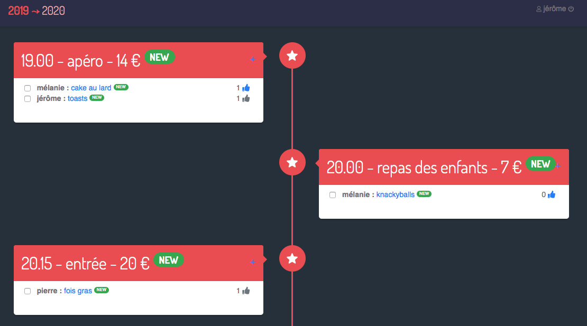

# Réveillon

Site vite fait pour organiser le repas du nouvel an entre potes, initialement écrit en angular 8 + bootstrap 4.
Les pages et les données sont hébergées sur firebase (cloud firestore + hosting).



Chaque participant peut ajouter les plats qu'il veut amener (description courte + prix approximatif) et _liker_ les plats des autres.
Le plat peut être coché pour indiquer aux autres que le choix est validé et qu'il sera bien présent au jour J.
Le prix indiqué permet de calculer la part que chacun devra payer (partage équitable, total / nombre de participants).


## Setup 

Nécessite une base de données firecloud à configurer dans `environment.ts` (celui de dév ET celui de prod).

```
config_firebase: {
    apiKey: "AIzaS...Wwyc",
    authDomain: "...m",
    databaseURL: "https://...",
    projectId: "...",
    storageBucket: "xxx.appspot.com",
    messagingSenderId: "...",
    appId: "..."
}
```

L'application intialise toute seule les données de fonctionnement (tranches horaires).
L'accès à l'application est retreint, l'utilisateur doit saisir son prénom qui doit
être présent dans le liste des prénoms autorisés (sécurité bidon mais suffisante ^^).

Pour déployer :

```
$ ng build --prod
$ firebase login
$ firebase init
-> public directory : dist/reveillon
-> overwrite index.html : No !
$ firebase deploy
```

## Migration Angular 10

* https://stackoverflow.com/questions/62687896/how-to-import-firebase-auth-to-angular-10